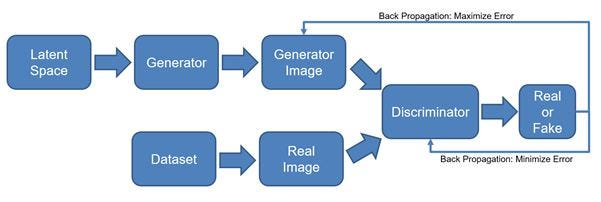
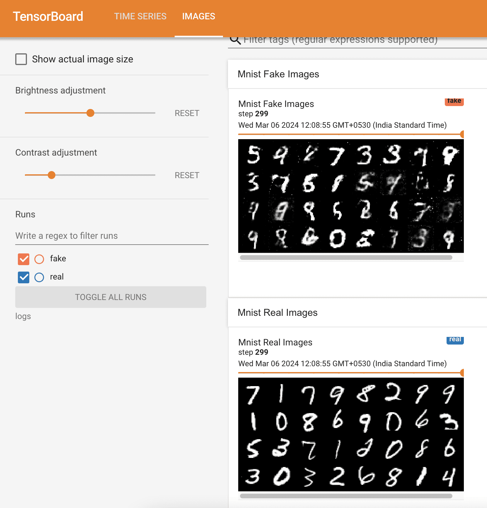

# GAN Implementation in PyTorch[^1]

## 1. Introduction

In this tutorial, we’ll show how to implement generative adversarial networks (GANs) in PyTorch, a popular machine-learning framework.

## 2. GAN

GAN is a type of generative model with roots in adversarial and game theory. Here, we train two competing and cooperating neural networks called generator (G ) and discriminator or critic (D). Both of them play a zero-sum game, such that G generates synthetic data to fool D while D works on distinguishing synthetic from actual data.

### 2.1. Architecture

Here is the basic architecture of a GAN with an example of image generation:



So, GANs follow an adversarial approach to learn the input distribution. Then it generates new data points similar to but not the same as the training dataset. The generator $G$ and discriminator $D$ work in tandem. First, $G$ takes random values from a multivariate Gaussian and produces a synthetic image. After that, $D$ learns to distinguish between the real and the generated images. The goal of $G$ is to produce a realistic sample that can fool $D$, whereas $D$ has the opposite goal: to learn to differentiate actual from fake images.

Although GANs aren’t limited to image generation, that’s probably their most well-known application.

## 3. Code Setup

Let’s look at a simple implementation of a GAN in Python using PyTorch. We can also implement a GAN using the TensorFlow framework.

First, we set up a virtual environment for this code. We can use the pyenv or virtualenv tools to create this environment. After activating the new environment, we should install all the necessary libraries:

- torch
- torchvision
- tqdm
- transformers
- numpy

We’ll use the following libraries for visualization:

- tensorboard
- tensorboard-data-server
- tensorboardX

## 4. Libraries and Data

Let’s load the necessary libraries:

```python
# For image transforms
import torchvision.transforms as transforms
# For Pytorch methods
import torch
import torch.nn as nn
# For Optimizer
import torch.optim as optim
import torchvision
# For DATA SET
import torchvision.datasets as datasets
# FOR DATA LOADER
from torch.utils.data import DataLoader
# FOR TENSOR BOARD VISUALIZATION
from torch.utils.tensorboard import SummaryWriter # to print to tensorboard
```

We use Tensorboard as our visualization tool and MNIST as our dataset. MNIST is a handwritten digit database with each digit as a 28X28 monochrome image. We download the dataset in the folder dataset. The code creates this folder if it’s not present in the current working directory:

```python
print(f"\nLoading MNIST DS")
dataset = datasets.MNIST(root="dataset/",
                         transform=myTransforms,
                         download=True)
loader = DataLoader(dataset,
                    batch_size=Config.batchSize,
                    shuffle=True)
```

## 5. GAN Hyperparameters

We used the following hyperparameters for our GAN:

```python
class Config:
    device = "cuda" if torch.cuda.is_available() else "cpu"
    lr = 3e-4
    zDim = 128 # 64, 128, 256
    imageDim = 28 * 28 * 1  # 784
    batchSize = 32  # Batch size
    numEpochs = 100  # Change as per your need
    logStep = 625  # Change as per your need
```

Each image sample is flattened to a 784-dimensional vector (imageDim).

Since GANs are sensitive to [hyperparameters](https://www.baeldung.com/cs/non-trainable-parameter), we need to finetune them for performance. That’s out of the scope of this article, so we’ll work with the above values as if we got them using cross-validation or another tuning technique.

## 6. Generator

We used a sequential neural network to implement the generator block. It comprises an input layer with the Leaky ReLu() activation function, followed by a single hidden layer with the tanh() activation function. We can configure the hiddenDim and lr parameters as necessary:

```python
class Generator(nn.Module):
    def __init__(self, zDim, imgDim, hiddenDim=512, lr=0.01):
        super().__init__()
        self.gen = nn.Sequential(
            nn.Linear(zDim, hiddenDim),
            nn.LeakyReLU(lr),
            nn.Linear(hiddenDim, imgDim),
            nn.Tanh(),  # We normalize inputs to [-1, 1] so make outputs [-1, 1]
        )

    def forward(self, x):
        return self.gen(x)
```

## 7. Discriminator

The discriminator network is similar to the generator. However, its output layer gives a single output (1 for real data and 0 for synthetic data):

```python
class Discriminator(nn.Module):
    def __init__(self, inFeatures, hiddenDim=512, lr=0.01):
        super().__init__()
        self.disc = nn.Sequential(
            nn.Linear(inFeatures, hiddenDim),
            nn.LeakyReLU(lr),
            nn.Linear(hiddenDim, 1),
            nn.Sigmoid(),
        )

    def forward(self, x):
        return self.disc(x)
```

### 8. Preliminaries

Let’s go through the training and visualization part. We first create the generator and discriminator objects. Then, we sample the standard Gaussian noise to generate random samples. Following this step, we normalize the monochromatic image map (784-dimensional vector) and convert it to a tensor for processing:

```python
discriminator = Discriminator(Config.imageDim).to(Config.device)
generator = Generator(Config.zDim,
                    Config.imageDim).to(Config.device)

# Fixed Noise
fixedNoise = torch.randn((Config.batchSize,
                              Config.zDim)).to(Config.device)

# Transforms
myTransforms = transforms.Compose(
        [
            transforms.ToTensor(),
            transforms.Normalize((0.5,), (0.5,)),
        ]
)
```

Normalization operation reduces each channel’s pixel value with its mean and divides the result with its standard deviation:

$$
  image =\frac{image - \mu}{\sigma}
$$

So, `transforms.Normalize((0.5,), (0.5,))` converts MNIST image pixel values from the range [0, 1] to [-1, 1]. Hence, this matches the tanh() output of $G$.

## 9. Optimizer

Next, we configure the Adam optimizer for both the generator and discriminator:

```python
print(f"\nSetting Optimizers")
optDisc = optim.Adam(discriminator.parameters(),
                     lr=Config.lr)
optGen = optim.Adam(generator.parameters(),
                    lr=Config.lr)
```

## 10. Loss

Following this, we set binary cross entropy (BCE) as our loss function:

```python
criterion = nn.BCELoss()
```

## 11. Image Grid

Now, we configure the summary writer classes of Tensorboard for visualization:

```python
writerFake = SummaryWriter(f"logs/fake")
writerReal = SummaryWriter(f"logs/real")
```

The class object writerFake will store synthetic images, whereas writerReal will store the real images in the folder logs. This folder is automatically created once we run the code.

## 12. Training

Finally, we come to the training step. We get a random batch of real images from our dataset in each epoch. Then, we train our discriminator by showing it synthetic and real images. Once that’s over, we train the generator, keeping the discriminator intact:

```python
step = 0
print(f"\nStarted Training and visualization...")
for epoch in range(Config.numEpochs):
    print('-' * 80)
    for batch_idx, (real, _) in enumerate(loader):
        # 28 * 28 *1 flattens to 784
        real = real.view(-1, 784).to(Config.device)
        batchSize = real.shape[0]
        ### Train Discriminator: max log(D(x)) + log(1 - D(G(z)))
        noise = torch.randn(batchSize,
                            Config.zDim).to(Config.device)
        fake = gen(noise)
        discReal = disc(real).view(-1)
        lossDreal = criterion(discReal,
                              torch.ones_like(discReal))
        discFake = disc(fake).view(-1)
        lossDfake = criterion(discFake,
                              torch.zeros_like(discFake))
        lossD = (lossDreal + lossDfake) / 2
        disc.zero_grad()
        lossD.backward(retain_graph=True)
        optDisc.step()

        ###
        # Train Generator: min log(1 - D(G(z))) <-> max log(D(G(z))
        # where the second option of maximizing doesn't suffer from
        # saturating gradients. Minimizing is easier
        ###
        output = disc(fake).view(-1)
        lossG = criterion(output,
                          torch.ones_like(output))
        gen.zero_grad()
        lossG.backward()
        optGen.step()

        # Visualize three steps for each epoch
        if batch_idx % Config.logStep == 0:
            step = prepareVisualization(epoch,
                                        batch_idx,
                                        len(loader),
                                        lossD,
                                        lossG,
                                        writerFake,
                                        writerReal,
                                        step)
```

## 13. Visualization

Our visualization function is as follows:

```python
def prepareVisualization(epoch,
                         batchIdx,
                         loaderLen,
                         lossD,
                         lossG,
                         writerFake,
                         writerReal,
                         step):
    print(
        f"Epoch [{epoch}/{Config.numEpochs}] Batch {batchIdx}/{loaderLen} \
                              Loss DISC: {lossD:.4f}, loss GEN: {lossG:.4f}"
    )

    with torch.no_grad():
        # Generate noise via Generator
        fake = gen(fixedNoise).reshape(-1, 1, 28, 28)

        # Get real data
        data = real.reshape(-1, 1, 28, 28)

        # Plot the grid
        imgGridFake = torchvision.utils.make_grid(fake,
                                                  normalize=True)
        imgGridReal = torchvision.utils.make_grid(data,
                                                  normalize=True)

        writerFake.add_image("Mnist Fake Images",
                             imgGridFake,
                             global_step=step)
        writerReal.add_image("Mnist Real Images",
                             imgGridReal,
                             global_step=step)
        # increment step
        step += 1

    return step
```

At regular intervals (ConfigParam.logStep) in each epoch, we plot a grid of synthetic images from the generator and real images from our dataset. We can see this grid on the Tensorboard web page as a continuous stream of data:



## 14. Conclusion

In this article, we showed how to implement GANs in PyTorch. GANs work as an adversarial zero-sum game between the generator and discriminator neural networks.

We use GANs for various tasks such as text generation, music composition, and 3D model creation. GANs are simple to understand but are challenging to train. We must balance the discriminator and generator correctly by choosing the optimal architecture and fine-tuning the hyperparameters.

Comments are open for 30 days after publishing a post. For any issues past this date, use the Contact form on the site.

[^1]: [https://www.baeldung.com/cs/pytorch-generative-adversarial-networks](https://www.baeldung.com/cs/pytorch-generative-adversarial-networks)
