# 可扩展：从0到100w用户

> 设计一个支持数百万用户的系统是具有挑战性的，这是一个需要不断完善和不断改进的过程。在本章中，我们将构建一个支持单个用户的系统，并逐渐扩展它以服务数百万用户。阅读本章后，您将掌握一些技巧，这些技巧将帮助您解答系统设计面试问题。

## 单服务器配置

千里之行始于足下，构建复杂的系统也是如此。为了从简单的开始，我们将所有内容都运行在一个单独的服务器上。图1-1展示了单一服务器设置的示意图，其中所有内容都在一个服务器上运行：Web应用程序、数据库、缓存等。

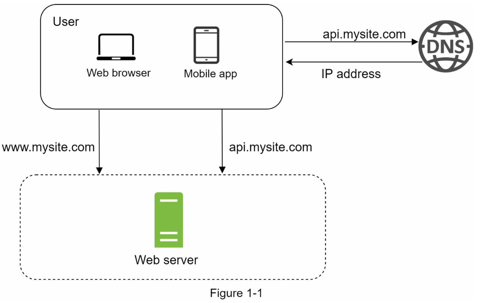

1. 用户通过域名访问网站，例如api.mysite.com。通常，域名系统（DNS）是由第三方提供的付费服务，并不由我们的服务器托管。
2. Internet Protocol（IP）地址被返回给浏览器或移动应用程序。在这个例子中，返回的IP地址是15.125.23.214。
3. 一旦获得了IP地址，Hypertext Transfer Protocol（HTTP）[^1]请求将直接发送到您的Web服务器。
4. Web服务器返回HTML页面或JSON响应用于渲染。

## 数据库

随着用户基数的增长，一个服务器已经不够，我们需要多个服务器：一个用于处理Web/移动流量，另一个用于数据库（图1-3）。将Web/移动流量（Web层）和数据库（数据层）服务器分开，使它们可以独立扩展。

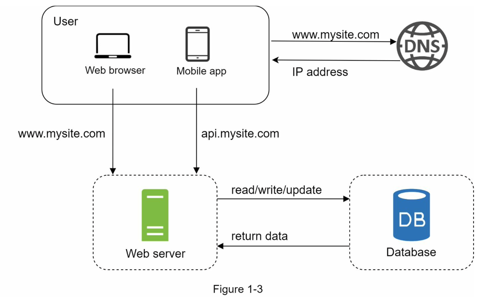

### 应该选择怎样的数据库

您可以选择传统的关系型数据库和非关系型数据库。让我们来看一下它们的区别。

关系型数据库也被称为关系数据库管理系统（RDBMS）或SQL数据库。最流行的包括MySQL、Oracle数据库、PostgreSQL等。关系型数据库通过表和行来表示和存储数据。您可以使用SQL在不同的数据库表之间执行连接操作。

非关系型数据库也被称为NoSQL数据库。流行的包括CouchDB、Neo4j、Cassandra、HBase、Amazon DynamoDB等[^2]。这些数据库被分为四类：键值存储、图形存储、列存储和文档存储。在非关系型数据库中通常不支持连接操作。

对于大多数开发人员来说，关系型数据库是最佳选择，因为它们已经存在了40多年，历史上一直表现良好。然而，如果关系型数据库不适用于您的特定用例，探索非关系型数据库是至关重要的。非关系型数据库可能是正确的选择，如果：

- 您的应用程序需要超低延迟。
- 您的数据是非结构化的，或者您没有任何关系型数据。
- 您只需要对数据进行序列化和反序列化（JSON、XML、YAML等）。
- 您需要存储大量数据。

## 水平扩展和垂直扩展

垂直扩展，也称为“纵向扩展”，是向服务器添加更多的计算能力（CPU、RAM等）的过程。水平扩展，也称为“横向扩展”，允许您通过向资源池中添加更多服务器来进行扩展。

当流量较低时，垂直扩展是一个很好的选择，其主要优势在于简单性。不幸的是，它也带来了严重的限制。

- 垂直扩展有一个严格的限制。无法对单个服务器无限添加CPU和内存。
- 垂直扩展没有故障转移和冗余。如果一个服务器出现故障，网站/应用程序将完全宕机。

由于垂直扩展的限制，对于大规模应用程序来说，水平扩展更加理想。

在之前的设计中，用户直接连接到Web服务器。如果Web服务器离线，用户将无法访问网站。在另一种情况下，如果许多用户同时访问Web服务器并且达到Web服务器的负载极限，用户通常会遇到较慢的响应或无法连接到服务器。负载均衡器是解决这些问题的最佳技术。

## 负载均衡

负载均衡器将传入的流量均匀地分配给定义在负载均衡集中的Web服务器。图1-4展示了负载均衡器的工作原理。

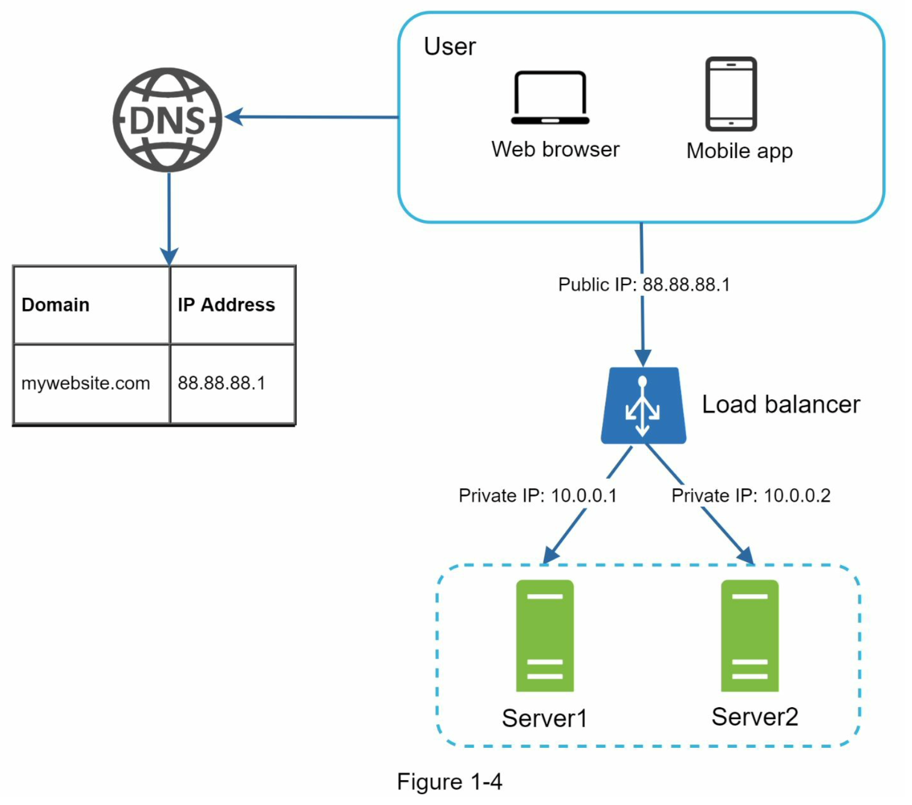

如图1-4所示，用户直接连接到负载均衡器的公共IP。通过这种设置，客户端不再直接访问Web服务器。为了更好的安全性，服务器之间的通信使用私有IP地址。私有IP是一种仅在同一网络中的服务器之间可达的IP地址，但它在互联网上无法访问。负载均衡器通过私有IP与Web服务器进行通信。

在图1-4中，当添加了负载均衡器和第二个Web服务器后，我们成功解决了故障转移问题，并提高了Web层的可用性。具体细节如下:

- 如果服务器1离线，所有流量将被路由到服务器2，防止网站宕机。我们还会将一个新的健康Web服务器添加到服务器池，以平衡负载。
- 如果网站流量迅速增长，两个服务器无法处理这些流量，负载均衡器可以优雅地解决这个问题。您只需要向Web服务器池中添加更多服务器，负载均衡器将自动开始将请求发送到这些服务器上。

现在Web层看起来不错，那数据层呢？当前的设计只有一个数据库，因此不支持故障转移和冗余。数据库复制是解决这些问题的常见技术。让我们来看一下。

## 数据库复制

引用自维基百科："数据库复制可以在许多数据库管理系统中使用，通常在原始数据库（主数据库）与副本（从数据库）之间建立主/从关系。" [^3]。

主数据库通常只支持写操作，而从数据库从主数据库获取数据的副本，并且仅支持读操作。所有的数据修改命令，如插入、删除或更新，必须发送到主数据库。大多数应用程序需要更高的读写比例，因此系统中从数据库的数量通常大于主数据库的数量。图1-5展示了一个带有多个从数据库的主数据库。

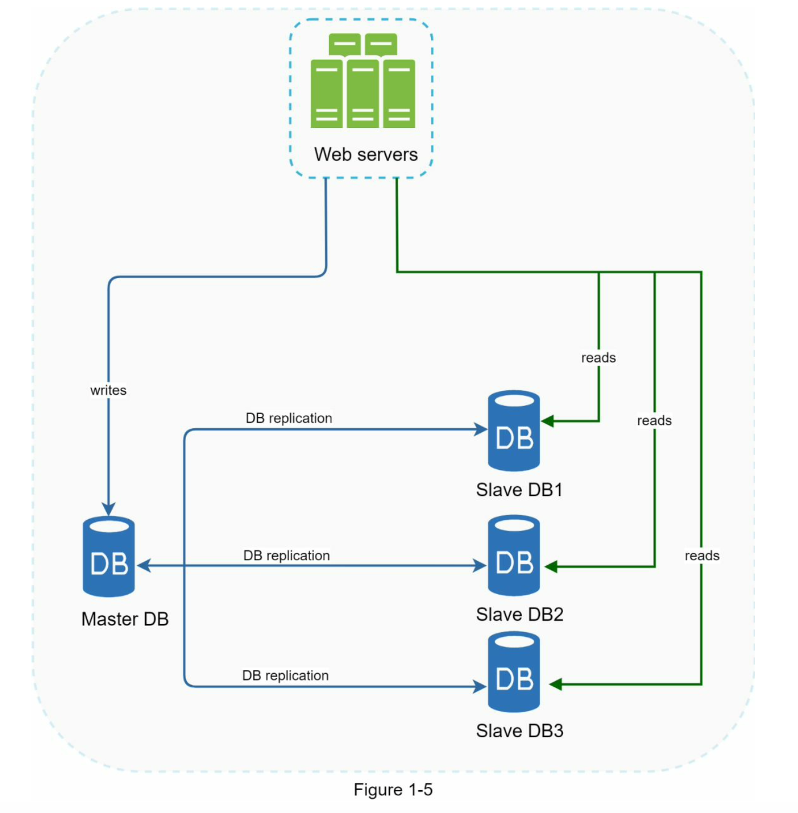

数据库复制的优势：

- 更好的性能：在主从模型中，所有写入和更新操作发生在主节点上，而读操作分布在从节点上。这种模型改善了性能，因为它允许更多查询并行处理。
- 可靠性：如果你的一个数据库服务器被自然灾害（如台风或地震）摧毁，数据仍然得以保留。你不需要担心数据丢失，因为数据被复制到多个位置。
- 高可用性：通过在不同位置复制数据，即使一个数据库离线，你的网站仍然可以继续运行，因为你可以访问存储在另一个数据库服务器中的数据。

在前面的部分中，我们讨论了负载均衡器如何帮助改善系统的可用性。在这里我们提出同样的问题：如果其中一个数据库离线了怎么办？图1-5中讨论的架构设计可以处理这种情况：

- 如果只有一个从数据库可用并且它离线了，读操作将暂时定向到主数据库。一旦问题被发现，新的从数据库将取代旧的从数据库。如果有多个从数据库可用，读操作将被重新定向到其他健康的从数据库，同时一个新的数据库服务器将取代旧的从数据库。
- 如果主数据库离线，将有一个从数据库晋升为新的主数据库。所有数据库操作将在新的主数据库上暂时执行。立即有一个新的从数据库取代旧的从数据库进行数据复制。在生产系统中，提升新的主数据库更复杂，因为从数据库中的数据可能不是最新的。需要通过运行数据恢复脚本来更新缺失的数据。虽然一些其他的复制方法，如多主复制和循环复制，可以帮助解决问题，但这些设置更复杂，超出了本书的范围。有兴趣的读者可以参考所列出的参考资料[^4][^5]。

图1-6展示了在添加负载均衡器和数据库复制后的系统设计。

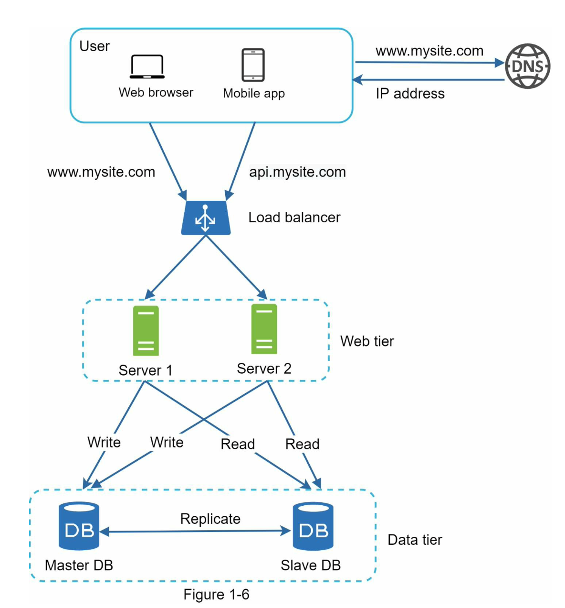

让我们来看一下这个设计：

- 用户从DNS获取负载均衡器的IP地址。
- 用户使用该IP地址连接到负载均衡器。
- HTTP请求被路由到服务器1或服务器2之一。
- Web服务器从从数据库中读取用户数据。
- Web服务器将任何数据修改操作路由到主数据库。这包括写入、更新和删除操作。

现在，您对Web层和数据层有了扎实的了解，现在是时候提高负载和响应时间了。可以通过添加缓存层并将静态内容（JavaScript/CSS/图像/视频文件）移至内容分发网络（CDN）来实现这一目标。

## 缓存

缓存是一个临时存储区，它将昂贵的响应结果或经常访问的数据存储在内存中，以便后续请求能够更快地得到响应。如图1-6所示，每次加载新的网页时，将执行一个或多个数据库调用来获取数据。频繁调用数据库会极大地影响应用程序的性能。缓存可以缓解这个问题。

### 缓存层

缓存层是一个临时数据存储层，比数据库快得多。拥有单独的缓存层的好处包括更好的系统性能，能够减轻数据库工作负载，以及能够独立扩展缓存层。图1-7展示了一个可能的缓存服务器设置：

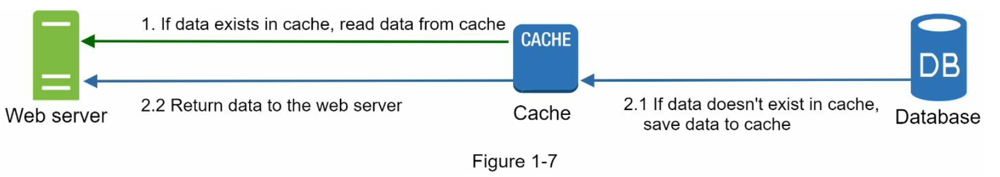

在收到请求后，Web服务器首先检查缓存中是否有可用的响应。如果有，它将数据发送回客户端。如果没有，它会查询数据库，将响应存储在缓存中，并将其发送回客户端。这种缓存策略称为读取穿透缓存。根据数据类型、大小和访问模式，还可以使用其他缓存策略。以前的研究解释了不同缓存策略的工作原理[^6]。

与缓存服务器交互是简单的，因为大多数缓存服务器都提供常见编程语言的API。以下代码片段显示了典型的Memcached API：（以下是代码示例，实际内容超出了可显示的范围）

```js
SECONDS = 1
cache.set('myKey','hi there',3600*SECONDS)
cache.get('myKey')
```

使用缓存系统时需要考虑以下几点：

- 决定何时使用缓存。考虑在数据频繁读取但较少修改的情况下使用缓存。由于缓存的数据存储在易失性内存中，缓存服务器不适合用于持久化数据。例如，如果缓存服务器重新启动，内存中的所有数据将丢失。因此，重要的数据应该保存在持久化数据存储中。
- 过期策略。实现一个过期策略是一个好的做法。一旦缓存数据过期，它将从缓存中移除。如果没有过期策略，缓存数据将永久存储在内存中。建议不要将过期时间设置得太短，否则系统会太频繁地从数据库重新加载数据。同时，也不要将过期时间设置得太长，否则数据可能会变得过时。
- 一致性：这涉及保持数据存储和缓存同步。由于数据存储和缓存上的数据修改操作不在单个事务中，可能会发生不一致的情况。在跨多个地区进行扩展时，维护数据存储和缓存之间的一致性可能是一个挑战。有关更多详细信息，请参阅Facebook发表的题为“Scaling Memcache at Facebook”的论文[^7]。
- 缓解故障：单个缓存服务器可能成为潜在的单点故障（SPOF），维基百科对其的定义如下：“单点故障（SPOF）是系统中的一部分，如果它发生故障，将导致整个系统停止工作” [^8]。因此，建议在不同数据中心部署多个缓存服务器，以避免SPOF。另一个建议的方法是将所需内存过度预留一定比例。这样可以提供缓冲，以应对内存使用增加的情况。
- 驱逐策略：一旦缓存已满，任何试图将项目添加到缓存中的请求可能导致现有项目被移除。这被称为缓存驱逐。最不经常使用（LRU）是最受欢迎的缓存驱逐策略。其他驱逐策略，例如最不频繁使用（LFU）或先进先出（FIFO），可以采用来满足不同的使用情况。

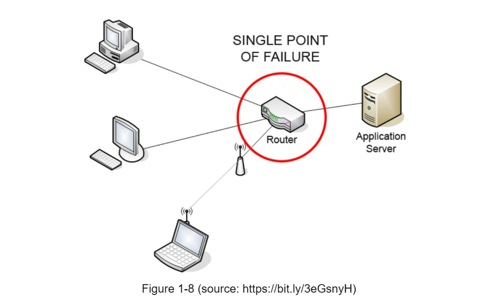

## 内容分发网络 (CDN)

CDN是一个由地理分散的服务器组成的网络，用于传送静态内容。CDN服务器缓存像图像、视频、CSS、JavaScript文件等静态内容。

动态内容缓存是一个相对较新的概念，超出了本书的范围。它可以缓存基于请求路径、查询字符串、Cookie和请求头的HTML页面。关于这方面的更多信息，请参考参考资料中提到的文章[^9]。本书的重点是如何使用CDN来缓存静态内容。

在高层次上，CDN的工作原理如下：当用户访问一个网站时，最靠近用户的CDN服务器将传送静态内容。直观地说，用户与CDN服务器的距离越远，网站加载速度越慢。例如，如果CDN服务器位于旧金山，洛杉矶的用户将比欧洲的用户更快地获取内容。图1-9是一个很好的例子，展示了CDN如何改善加载时间。

### 使用CDN的注意事项

- 成本：CDN由第三方提供商运营，您需要为进出CDN的数据传输付费。对于不经常使用的资源进行缓存可能没有太大的好处，因此您应该考虑将它们移出CDN。
- 设置适当的缓存过期时间：对于时间敏感的内容，设置适当的缓存过期时间很重要。缓存过期时间既不应该太长也不应该太短。如果时间太长，内容可能已经过期。如果时间太短，会导致重复从源服务器重新加载内容到CDN。
- CDN回退：您应该考虑您的网站/应用程序在CDN故障时的应对措施。如果出现临时CDN中断，客户端应该能够检测问题并从源获取资源。
- 文件失效：您可以在文件过期之前从CDN中删除该文件，可以执行以下操作之一：
  - 使用CDN供应商提供的API使CDN对象失效。
  - 使用对象版本控制来提供对象的不同版本。要为对象版本化，您可以在URL中添加一个参数，比如版本号。例如，将版本号2添加到查询字符串：image.png?v=2。

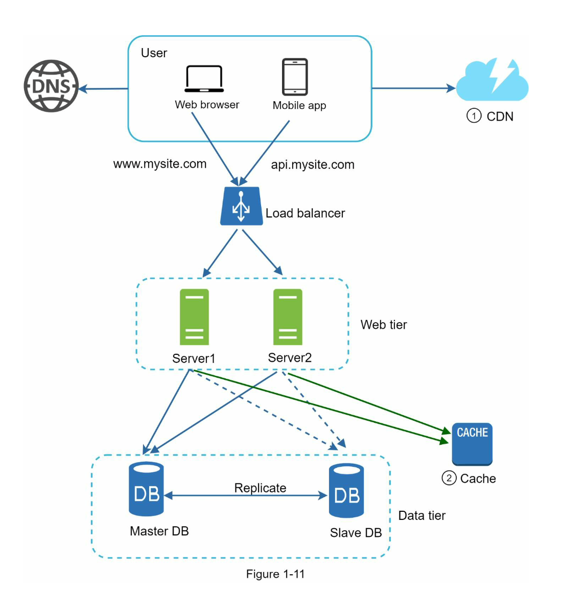

## 无状态的Web层

现在是时候考虑水平扩展Web层了。为此，我们需要将状态（例如用户会话数据）移出Web层。一个好的做法是将会话数据存储在持久化存储中，比如关系型数据库或NoSQL数据库。集群中的每个Web服务器都可以从数据库中访问状态数据。这被称为无状态Web层。

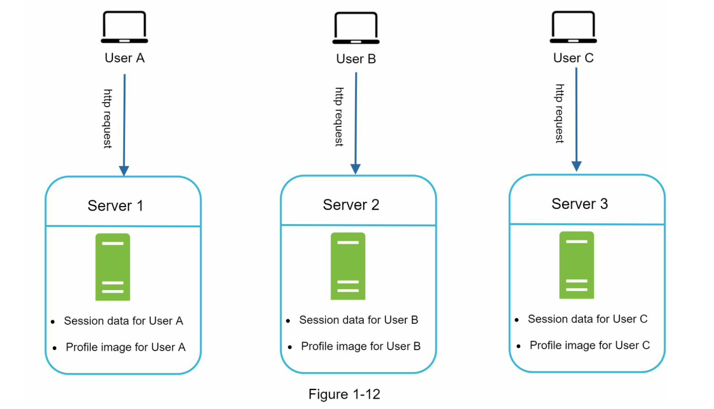

在图1-12中，用户A的会话数据和个人头像存储在服务器1中。要对用户A进行身份验证，HTTP请求必须路由到服务器1。如果请求发送到其他服务器，比如服务器2，身份验证将失败，因为服务器2不包含用户A的会话数据。同样，来自用户B的所有HTTP请求必须路由到服务器2；所有来自用户C的请求必须发送到服务器3。

问题在于，来自同一客户端的每个请求必须路由到相同的服务器。这可以通过大多数负载均衡器中的粘性会话（sticky sessions）来实现[^10]；然而，这会增加额外的开销。使用这种方法增加或删除服务器更加困难。同时，处理服务器故障也具有挑战性。

### 无状态架构

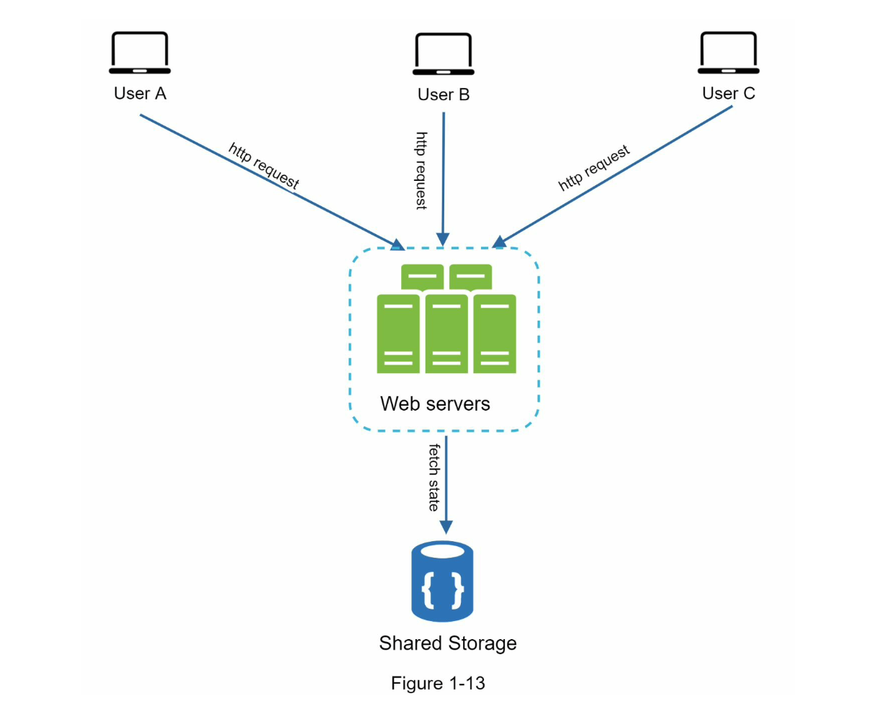

在这种无状态架构中，来自用户的HTTP请求可以发送到任何Web服务器，这些服务器从共享数据存储中获取状态数据。状态数据存储在共享数据存储中，而不在Web服务器中。无状态系统更简单、更强大和可扩展。

图1-14展示了带有无状态Web层的更新设计。

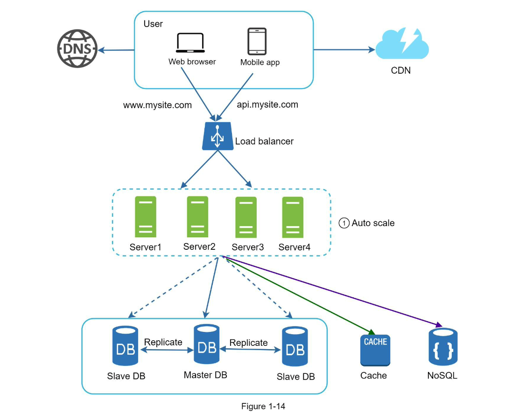

在图1-14中，我们将会话数据从Web层移出，并将它们存储在持久化数据存储中。共享数据存储可以是关系型数据库、Memcached/Redis、NoSQL等。选择NoSQL数据存储是因为它易于扩展。自动扩展是指根据流量负载自动添加或删除Web服务器。在状态数据从Web服务器中移除之后，通过根据流量负载添加或删除服务器轻松实现Web层的自动扩展。

您的网站迅速增长，并吸引了大量国际用户。为了提高可用性并在更广泛的地理区域提供更好的用户体验，支持多个数据中心是至关重要的。

## 数据中心

图1-15显示了一个带有两个数据中心的示例设置。在正常运行时，用户被地理DNS路由（也称为地理路由）到最近的数据中心，其中x％的流量在美国东部，而（100 - x）％的流量在美国西部。geoDNS是一种DNS服务，它允许根据用户所在的位置将域名解析为IP地址。

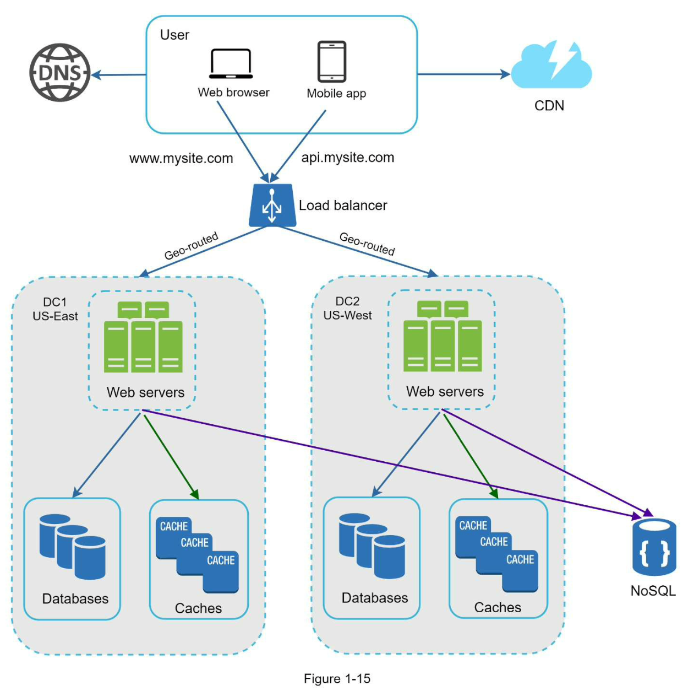

在发生任何重要数据中心故障的情况下，我们会将所有流量重定向到一个正常运行的数据中心。在图1-16中，数据中心2（美国西部）处于离线状态，所有100％的流量都被路由到数据中心1（美国东部）。

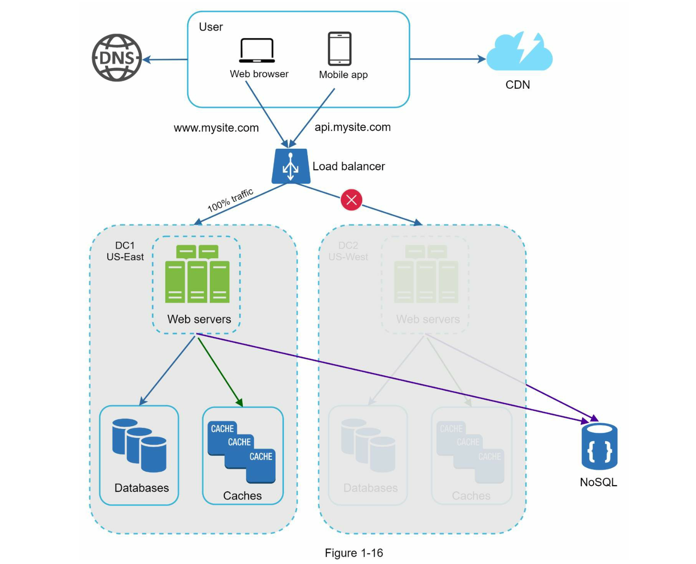

要实现多数据中心设置，需要解决几个技术挑战：

- 流量重定向：需要有效的工具将流量定向到正确的数据中心。可以使用地理DNS将流量路由到离用户最近的数据中心。
- 数据同步：不同地区的用户可能使用不同的本地数据库或缓存。在故障转移情况下，流量可能被路由到数据中心，而该数据中心的数据不可用。一种常见的策略是在多个数据中心之间复制数据。之前的研究显示了Netflix如何实现异步多数据中心复制[^11]。
- 测试和部署：在多数据中心设置中，重要的是在不同地点测试您的网站/应用程序。自动化部署工具对于在所有数据中心保持服务一致至关重要[^11]。
为了进一步扩展我们的系统，我们需要解耦系统的不同组件，使它们可以独立扩展。消息队列是许多实际分布式系统采用的关键策略，用于解决这个问题。

## 消息队列

消息队列是一种持久的组件，存储在内存中，用于支持异步通信。它充当缓冲区并分发异步请求。消息队列的基本架构很简单。输入服务，称为生产者/发布者，创建消息并将其发布到消息队列。其他服务或服务器，称为消费者/订阅者，连接到队列，并执行消息定义的操作。该模型如图1-17所示。

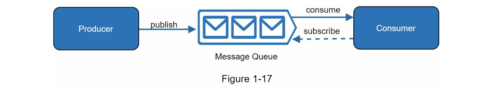

解耦使得消息队列成为构建可扩展和可靠应用程序的首选架构。通过消息队列，当消费者无法处理消息时，生产者可以将消息发布到队列中。即使生产者不可用，消费者也可以从队列中读取消息。

考虑以下用例：您的应用程序支持照片定制，包括裁剪、锐化、模糊等操作。这些定制任务需要一定时间来完成。在图1-18中，Web服务器将照片处理作业发布到消息队列中。照片处理工作者从消息队列中获取作业，并异步执行照片定制任务。生产者和消费者可以独立扩展。当队列的大小变大时，可以添加更多的工作者来缩短处理时间。然而，如果队列大部分时间都是空的，那么可以减少工作者的数量。

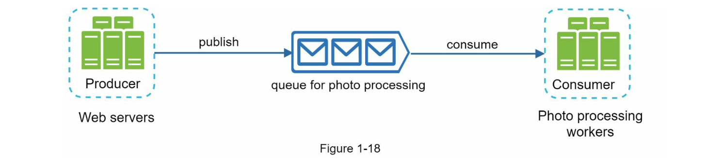

## 日志记录、度量和自动化

日志记录、度量和自动化支持是一个小型网站运行在几台服务器上时的良好实践，但不是必需品。然而，现在您的网站已经发展成为服务于大型企业的规模，投资这些工具变得至关重要。

日志记录：监视错误日志很重要，因为它有助于识别系统中的错误和问题。您可以在每个服务器级别监视错误日志，或使用工具将它们聚合到一个集中式服务中，以便轻松搜索和查看。

度量：收集不同类型的度量数据有助于我们获得业务见解并了解系统的健康状态。以下是一些有用的度量指标：

- 主机级度量：CPU、内存、磁盘I/O等。
- 聚合级别度量：例如整个数据库层、缓存层等的性能。
- 关键业务度量：每日活跃用户、留存率、收入等。

自动化：当系统变得庞大和复杂时，我们需要构建或利用自动化工具来提高生产力。持续集成是一个良好的实践，通过自动化验证每次代码提交，使团队能够及早发现问题。此外，自动化构建、测试、部署过程等可以显著提高开发人员的生产力。

### 添加消息队列和不同的工具

图1-19显示了更新后的设计。由于空间限制，图中仅显示了一个数据中心。

1. 该设计包括了一个消息队列，它有助于使系统更松散耦合和更具容错性。
2. 还包括了日志记录、监控、度量和自动化工具。

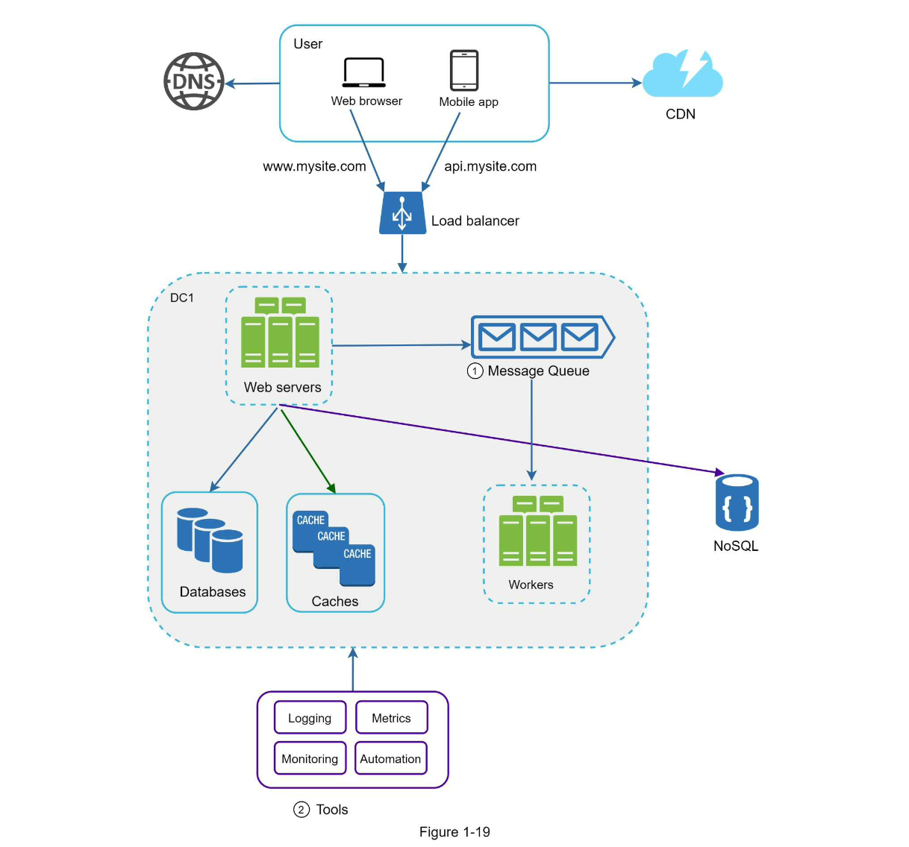

随着数据每天增长，您的数据库负载越来越重。现在是时候扩展数据层了。

## 数据库扩展

数据库扩展有两种广义的方法：垂直扩展和水平扩展。

### 垂直扩展

垂直扩展，也称为纵向扩展，是通过向现有的服务器添加更多的计算资源（CPU、RAM、磁盘等）来进行扩展。有一些强大的数据库服务器。根据亚马逊关系型数据库服务（Amazon RDS）[^12]，您可以获得一台具有24 TB RAM的数据库服务器。这种强大的数据库服务器可以存储和处理大量数据。例如，2013年的stackoverflow.com网站每月有超过1000万独立访问者，但它只有1个主数据库[^13]。然而，垂直扩展也有一些严重的缺点：

- 您可以向数据库服务器添加更多的CPU、RAM等资源，但硬件有其限制。如果您有庞大的用户群体，单个服务器可能不足够。
- 单点故障的风险增加。
- 垂直扩展的整体成本较高。强大的服务器价格更昂贵。

### 水平扩展

水平扩展，也称为分片，是添加更多服务器的实践。图1-20对比了垂直扩展和水平扩展。

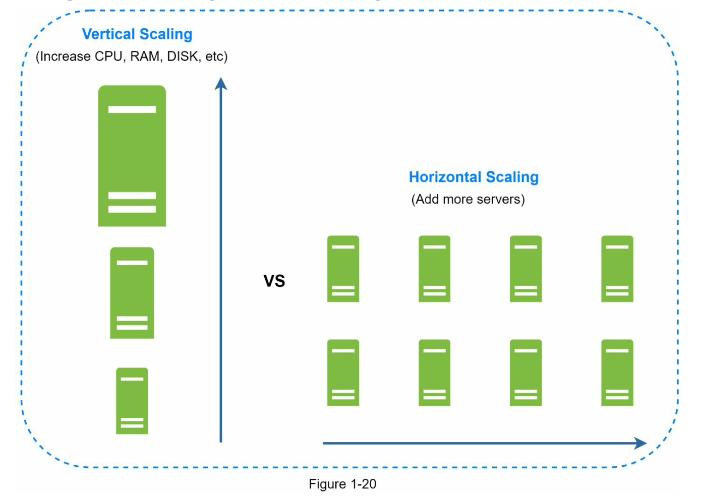

分片（Sharding）将大型数据库分成更小、更易管理的部分，称为分片。每个分片共享相同的架构，尽管每个分片上的实际数据是独特的。

图1-21显示了一个分片数据库的示例。用户数据根据用户ID分配到数据库服务器。每次访问数据时，都会使用哈希函数找到相应的分片。在我们的例子中，user_id % 4被用作哈希函数。如果结果等于0，则使用分片0来存储和获取数据。如果结果等于1，则使用分片1。其他分片也是按照相同的逻辑进行分配。

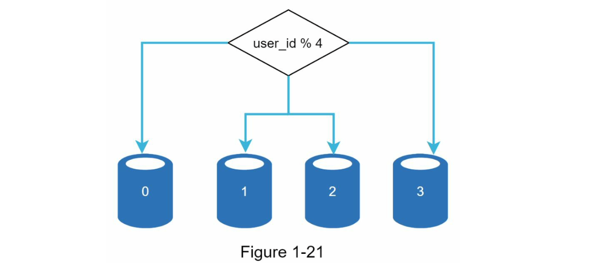

图1-22展示了分片数据库中的用户表。

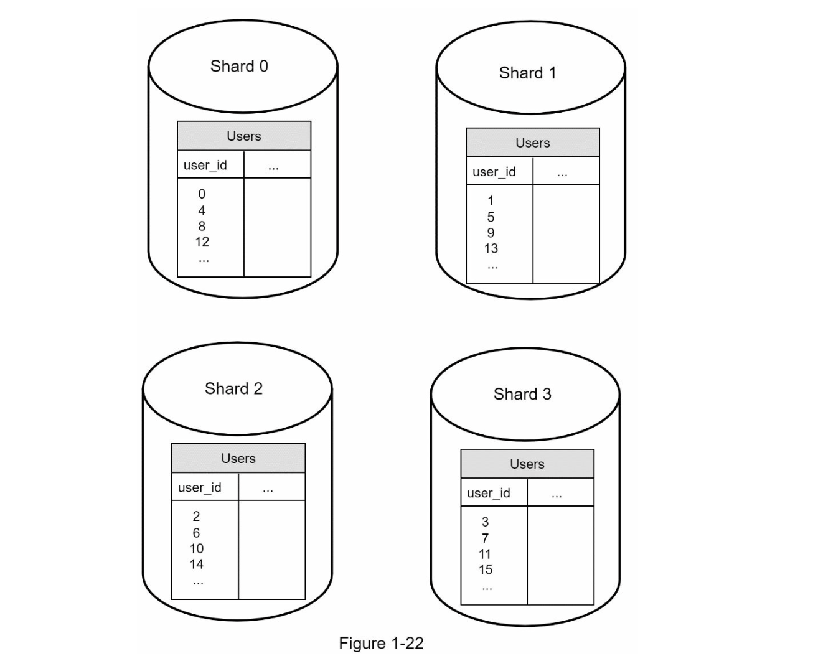

在实施分片策略时，最重要的因素是选择分片键（也称为分区键）。分片键由一个或多个列组成，用于确定数据的分布方式。如图1-22所示，“user_id”是分片键。分片键允许您通过将数据库查询路由到正确的数据库来高效地检索和修改数据。在选择分片键时，最重要的标准之一是选择一个可以均匀分布数据的键。

分片是扩展数据库的一种很好的技术，但并不是完美的解决方案。它为系统引入了复杂性和新的挑战：

**重新分片数据**：当1）单个分片由于快速增长而无法容纳更多数据时，需要重新分片数据。2）由于数据分布不均，某些分片可能比其他分片更快地达到分片耗尽状态。当发生分片耗尽时，需要更新分片函数并移动数据。一种常用的解决这个问题的技术是一致性哈希（consistent hashing），将在第5章中讨论。

**明星问题**：也称为热点键问题。对特定分片的过度访问可能导致服务器过载。想象一下，Katy Perry、Justin Bieber和Lady Gaga的数据都在同一个分片上。对于社交应用程序，该分片将被大量读取操作压倒。为解决这个问题，我们可能需要为每个名人分配一个分片。每个分片甚至可能需要进一步分区。

**连接和去规范化**：一旦数据库被分片到多个服务器上，就很难在数据库分片之间执行连接操作。一种常见的解决方法是对数据库进行去规范化，以便查询可以在单个表中执行。

在图1-23中，我们对数据库进行分片以支持快速增长的数据流量。同时，一些非关系型功能被移动到NoSQL数据存储中，以减轻数据库负担。下面是一篇涵盖许多NoSQL用例的文章 [^14]。

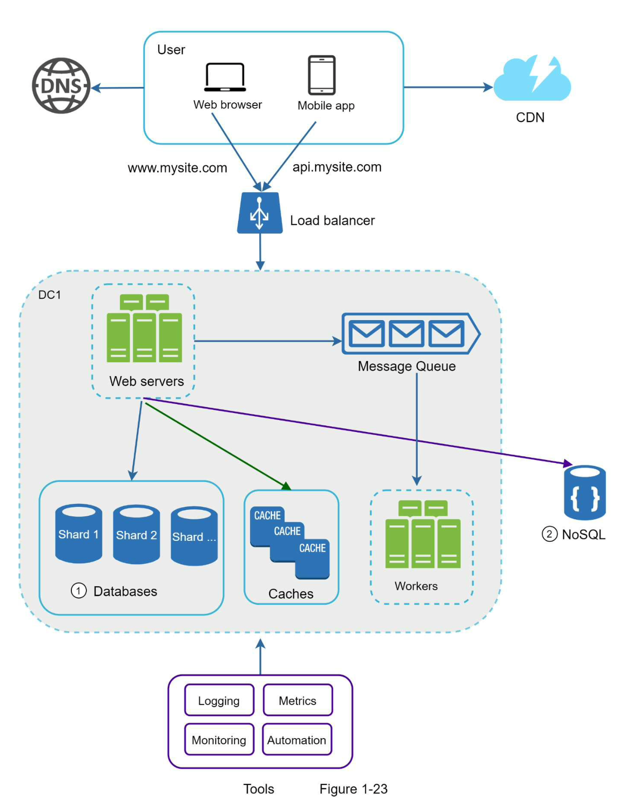

## 数百万用户及以上

扩展系统是一个迭代的过程。根据本章学到的内容进行迭代可以让我们取得很大的进展。需要更多的微调和新的策略来扩展到数百万用户以上。例如，您可能需要优化系统，并将系统解耦为更小的服务。本章学到的所有技术都应该为应对新的挑战提供了良好的基础。为了总结本章，我们提供了如何将系统扩展以支持数百万用户的摘要：

- 保持Web层无状态
- 在每个层级构建冗余
- 尽可能多地缓存数据
- 支持多个数据中心
- 在CDN中托管静态资源
- 通过分片扩展数据层
- 将层级拆分为单独的服务
- 监控您的系统并使用自动化工具

祝贺您走到了这一步！现在请为自己鼓掌👏。干得好！

[^1]: [Hypertext Transfer Protocol](https://en.wikipedia.org/wiki/Hypertext_Transfer_Protocol )
[^2]: [Should you go Beyond Relational Databases?](https://blog.teamtreehouse.com/should-you-go-beyond-relational-databases)
[^3]: [Replication](https://en.wikipedia.org/wiki/Replication_(computing))
[^4]: [Multi-master replication](https://en.wikipedia.org/wiki/Multi-master_replication)
[^5]: [NDB Cluster Replication: Multi-Master and Circular Replication](https://dev.mysql.com/doc/refman/5.7/en/mysql-cluster-replication-multi-master.html)
[^6]: [Caching Strategies and How to Choose the Right One](https://codeahoy.com/2017/08/11/caching-strategies-and-how-to-choose-the-right-one/)
[^7]: R. Nishtala, "Facebook, Scaling Memcache at," 10th USENIX Symposium on Networked Systems Design and Implementation (NSDI ’13).
[^8]: [Single point of failure](https://en.wikipedia.org/wiki/Single_point_of_failure)
[^9]: [Amazon CloudFront Dynamic Content Delivery](https://aws.amazon.com/cloudfront/dynamic-content/)
[^10]: [Configure Sticky Sessions for Your Classic Load Balancer](https://docs.aws.amazon.com/elasticloadbalancing/latest/classic/elb-sticky-sessions.html)
[^11]: [Active-Active for Multi-Regional Resiliency](https://netflixtechblog.com/active-active-for-multi-regional-resiliency-c47719f6685b)
[^12]: [Amazon EC2 High Memory Instances](https://aws.amazon.com/ec2/instance-types/high-memory/)
[^13]: [What it takes to run Stack Overflow](http://nickcraver.com/blog/2013/11/22/what-it-takes-to-run-stack-overflow)
[^14]: [What The Heck Are You Actually Using NoSQL For](http://highscalability.com/blog/2010/12/6/what-the-heck-are-you-actually-using-nosql-for.html)
