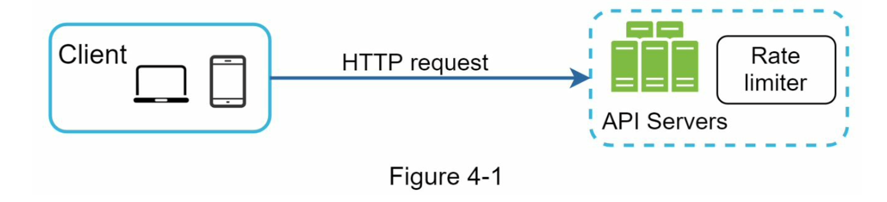
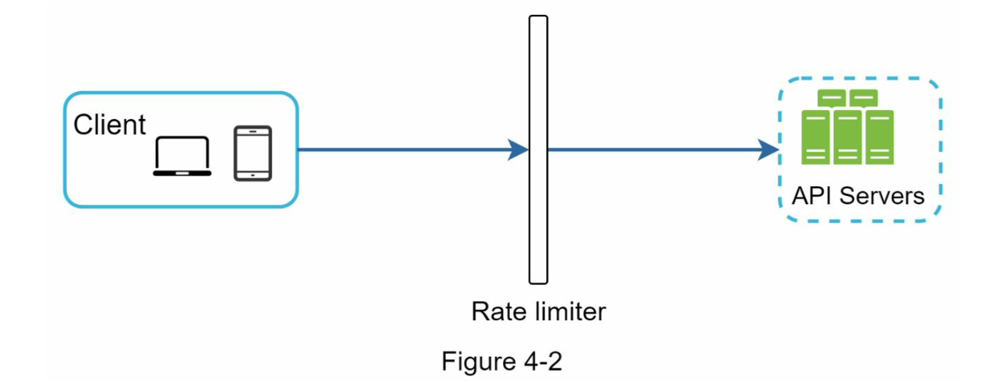
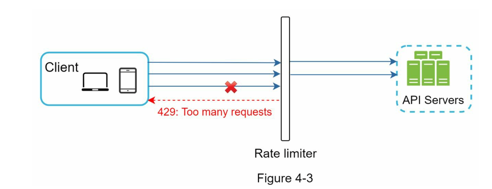
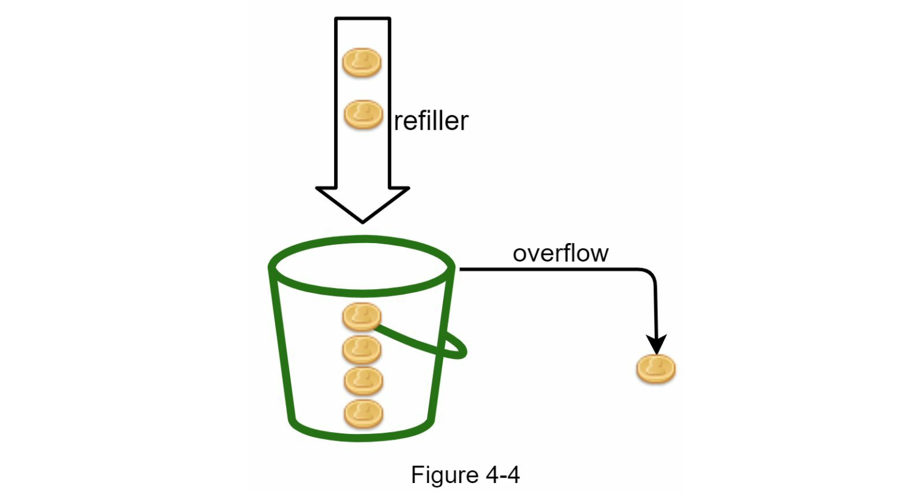

# 设计一个速率限制器

> 在一个网络系统中，使用速率限制器来控制客户端或服务发送的流量速率。在HTTP世界中，速率限制器限制在指定时间内允许发送的客户端请求次数。如果API请求计数超过速率限制器定义的阈值，所有多余的调用都将被阻止。

以下是一些例子：

- 一个用户每秒最多可以发表2篇帖子。
- 每天最多可以从同一个IP地址创建10个帐户。
- 每周最多可以从同一设备领取5次奖励。

在本章中，您被要求设计一个速率限制器。在开始设计之前，我们先来看一下使用API速率限制器的好处：

- 防止由拒绝服务（DoS）攻击引起的资源耗尽 [^1]。几乎所有大型科技公司发布的API都会强制执行某种形式的速率限制。例如，Twitter将每个用户在3小时内发送的推文数量限制为300条[^2]。Google文档API的默认限制如下：每个用户每60秒读取请求不超过300次[^3]。速率限制器通过阻止超额调用来防止DoS攻击，无论是故意还是无意的。
- 降低成本。限制超额请求意味着减少服务器数量，并将更多资源分配给高优先级的API。对于使用付费第三方API的公司来说，速率限制非常重要。例如，对以下外部API按每次调用收费：检查信用、进行付款、检索健康记录等。限制调用次数对于降低成本至关重要。
- 防止服务器过载。为了减少服务器负载，速率限制器用于过滤由机器人或用户不当行为引起的多余请求。

## 理解速率限制器

### 步骤1 - 理解问题并确定设计范围

速率限制可以使用不同的算法来实现，每种算法都有其优缺点。面试官和候选人之间的交流有助于澄清我们要构建的速率限制器类型。
候选人：我们将设计什么样的速率限制器？是客户端速率限制器还是服务器端API速率限制器？
面试官：很好的问题。我们专注于服务器端API速率限制器。
候选人：速率限制器是否基于IP、用户ID或其他属性来限制API请求？
面试官：速率限制器应该足够灵活，支持不同的限制规则集。
候选人：系统的规模是多大？是为初创公司还是大型用户基数的大公司构建的？
面试官：该系统必须能够处理大量请求。
候选人：该系统是否在分布式环境中运行？
面试官：是的。
候选人：速率限制器是一个单独的服务，还是应该在应用程序代码中实现？
面试官：这是您的设计决定。
候选人：我们需要通知受到限制的用户吗？
面试官：是的。
需求
以下是系统的要求摘要：

- 精确限制过多的请求。
- 低延迟。速率限制器不应影响HTTP响应时间。
- 尽可能少地使用内存。
- 分布式速率限制。速率限制器可以在多个服务器或进程之间共享。
- 异常处理。当用户的请求被限制时向他们显示清晰的异常信息。
- 高容错性。如果速率限制器出现任何问题（例如，缓存服务器离线），不影响整个系统。

### 步骤2 - 提出高层设计并获得认可

让我们保持简单，使用基本的客户端和服务器模型进行通信。
将速率限制器放在哪里？
直观地说，您可以在客户端或服务器端实现速率限制器。

- 客户端端实现。一般来说，客户端是实施速率限制的不可靠位置，因为恶意用户可以轻易伪造客户端请求。此外，我们可能无法控制客户端实现。
- 服务器端实现。图4-1显示了一个放置在服务器端的速率限制器。

除了客户端和服务器端的实现方式，还有另一种替代方法。我们可以不将速率限制器放在API服务器上，而是创建一个速率限制器中间件，用于限制对API的请求，如图4-2所示。

让我们使用图4-3中的示例来说明在这个设计中速率限制是如何工作的。假设我们的API允许每秒2个请求，一个客户端在一秒内向服务器发送了3个请求。前两个请求被路由到API服务器，但速率限制器中间件限制了第三个请求，并返回HTTP状态码429。HTTP 429响应状态码表示用户发送了太多请求。

云微服务[^4]已经变得非常流行，速率限制通常是在一个被称为API网关的组件中实现的。API网关是一个完全托管的服务，支持速率限制、SSL终止、身份验证、IP白名单、提供静态内容等功能。目前，我们只需要知道API网关是一个支持速率限制的中间件。

在设计速率限制器时，一个重要的问题是：速率限制器应该在服务器端还是网关中实现？并没有绝对的答案。这取决于您公司当前的技术堆栈、工程资源、优先级、目标等因素。以下是一些一般性的指导原则：

- 评估您当前的技术堆栈，例如编程语言、缓存服务等。确保您当前的编程语言能够有效地在服务器端实现速率限制。
- 确定适合您业务需求的速率限制算法。当您在服务器端实现所有功能时，您可以完全控制算法。然而，如果使用第三方网关，您的选择可能会受限。
- 如果您已经使用了微服务架构，并在设计中包含了API网关来执行身份验证、IP白名单等功能，则可以将速率限制器添加到API网关中。
- 自建速率限制服务需要时间。如果您没有足够的工程资源来实现速率限制器，商业API网关是一个更好的选择。

## 速率限制算法

速率限制可以使用不同的算法来实现，每个算法都有独特的优缺点。虽然本章不专注于算法，但高级别的了解有助于选择适合我们用例的正确算法或算法组合。以下是一些流行的算法列表：

- 令牌桶(Token bucket)
- 漏桶(Leaking bucket)
- 固定窗口计数器(Fixed window counter)
- 滑动窗口日志(Sliding window log)
- 滑动窗口计数器(Sliding window counter)

### 令牌桶算法

令牌桶算法被广泛用于速率限制。它简单易懂，并且被互联网公司广泛使用。亚马逊[^5]和Stripe[^6]都使用此算法来限制其API请求。

令牌桶算法的工作原理如下：

- 令牌桶是一个预先定义容量的容器。令牌以固定速率周期性地放入桶中。一旦桶满了，就不再添加令牌。如图4-4所示，令牌桶容量为4。重新填充器每秒往桶中放入2个令牌。一旦桶满了，多余的令牌会溢出。

**未完待续...**

[^1]: Rate-limiting strategies and techniques: <https://cloud.google.com/solutions/rate-limiting-> strategies-techniques
[^2]: Twitter rate limits: <https://developer.twitter.com/en/docs/basics/rate-limits>
[^3]: Google docs usage limits: <https://developers.google.com/docs/api/limits>
[^4]: IBM microservices: <https://www.ibm.com/cloud/learn/microservices>
[^5]: Throttle API requests for better throughput:
<https://docs.aws.amazon.com/apigateway/latest/developerguide/api-gateway-request-> throttling.html
[^6]: Stripe rate limiters: <https://stripe.com/blog/rate-limiters>
admin-api-rate-limits
