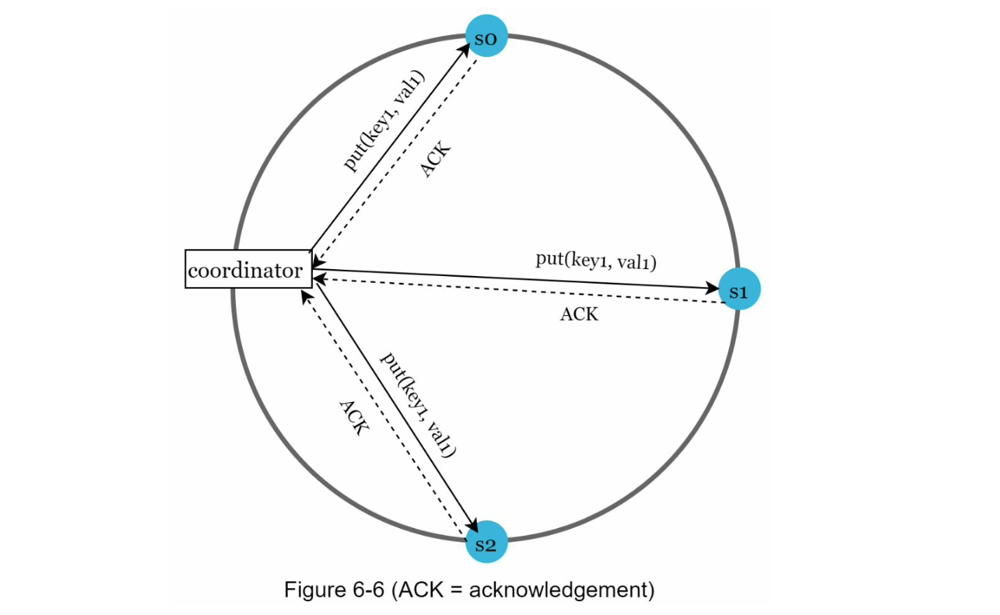

# 设计键值存储

> 键值存储，也称为键值数据库，是一种非关系型数据库。每个唯一标识符都被存储为一个键，带有与之关联的值。这种数据配对被称为“键值”对。

在键值对中，键必须是唯一的，并且可以通过键来访问与之关联的值。键可以是纯文本或哈希值。出于性能考虑，较短的键效果更好。键是什么样子的？以下是一些示例：

- 纯文本键：“last_logged_in_at”
- 哈希键：“253DDEC4”

键值对中的值可以是字符串、列表、对象等。在键值存储中，通常将值视为不透明对象，例如 Amazon Dynamo[^1]、Memcached[^2]、Redis[^3]等。

以下是一个键值存储中的数据片段示例：

|Key|Value |
|-|-|
|145|Alice|
|146|Bob|
|147|Tom|

在本章中，您被要求设计一个支持以下操作的键值存储：

- put(key, value) // 插入与“key”关联的“value”
- get(key) // 获取与“key”关联的“value”

## 理解问题并建立设计范围

没有完美的设计。每种设计在读取、写入和内存使用方面都有特定的权衡。另一个需要权衡的方面是一致性和可用性之间的平衡。在本章中，我们设计一个具有以下特点的键值存储：

- 键值对的大小较小：小于10 KB。
- 能够存储大数据。
- 高可用性：即使在出现故障时，系统仍能快速响应。
- 高可扩展性：系统可以扩展以支持大型数据集。
- 自动扩展：根据流量自动增加/删除服务器。
- 可调整的一致性。
- 低延迟。

## 单服务器键值存储

开发一个驻留在单个服务器中的键值存储是比较简单的。直观的方法是将键值对存储在哈希表中，并将所有内容保存在内存中。尽管内存访问速度很快，但由于空间限制，将所有数据都放入内存可能是不可能的。可以进行两个优化以在单个服务器中容纳更多数据：

- 数据压缩
- 只将频繁使用的数据存储在内存中，其余数据存储在磁盘上
即使进行了这些优化，单个服务器很快就可能达到其容量限制。为了支持大数据，需要一个分布式键值存储。

## 分布式键值存储

分布式键值存储也被称为分布式哈希表，它将键值对分布在许多服务器上。在设计分布式系统时，了解CAP（一致性、可用性、分区容忍性）定理非常重要。

!!! INFO CAP定理指出，在分布式系统中，不可能同时提供这三个保证中的两个以上：一致性、可用性和分区容忍性。我们先来建立一些定义。
    - 一致性：一致性意味着所有客户端无论连接到哪个节点，都能同时看到相同的数据。
    - 可用性：可用性意味着任何请求数据的客户端，即使有些节点已经宕机，也能收到响应。
    - 分区容忍性：分区指的是两个节点之间的通信中断。分区容忍性意味着尽管存在网络分区，系统仍然可以继续运行。

CAP定理表明，为了支持三个属性中的任意两个，必须牺牲其中一个属性，如图6-1所示。

如今，基于它们支持的两个CAP特性，键值存储被分类为以下三种类型：

- CP（一致性和分区容忍性）系统：CP键值存储支持一致性和分区容忍性，但会牺牲可用性。
- AP（可用性和分区容忍性）系统：AP键值存储支持可用性和分区容忍性，但会牺牲一致性。
- CA（一致性和可用性）系统：CA键值存储同时支持一致性和可用性，但可能会牺牲分区容忍性。

牺牲分区容忍性而保持可用性。由于网络故障是不可避免的，分布式系统必须容忍网络分区。因此，在现实世界的应用中，不可能存在CA系统。

上面所阐述的大部分内容主要是定义部分。为了更容易理解，让我们来看一些具体的例子。在分布式系统中，数据通常会被复制多次。假设数据被复制到三个副本节点n1、n2和n3，如图6-2所示。

### 理想情况

理想情况下，在网络不发生分区的情况下，写入到节点n1的数据会自动复制到节点n2和n3。这样既实现了一致性又保持了可用性。

### 现实

在分布式系统中，无法避免发生分区，而且当发生分区时，我们必须在一致性和可用性之间进行选择。在图6-3中，节点n3宕机，无法与节点n1和n2进行通信。如果客户端将数据写入n1或n2，数据无法传播到n3。如果数据被写入n3，但尚未传播到n1和n2，那么n1和n2将具有陈旧的数据。

如果我们选择一致性优先于可用性（CP系统），为了避免这三台服务器之间的数据不一致，我们必须阻塞所有对n1和n2的写入操作，这会使系统变得不可用。银行系统通常对一致性要求非常高。例如，对于银行系统来说，显示最新的账户余额信息非常重要。如果由于网络分区导致不一致性，银行系统会在解决不一致性之前返回错误。

然而，如果我们选择可用性优先于一致性（AP系统），系统会继续接受读取请求，即使可能返回陈旧的数据。对于写入操作，n1和n2将继续接受写入，并在网络分区解决后将数据同步到n3。

选择适合您用例的正确CAP保证是构建分布式键值存储的重要一步。您可以与面试官讨论这个问题，并相应地设计系统。

## 系统组件

在本节中，我们将讨论用于构建键值存储的以下核心组件和技术：

- 数据分区
- 数据复制
- 一致性
- 不一致性解决
- 处理故障
- 系统架构图
- 写入路径
- 读取路径

下面的内容主要基于三个流行的键值存储系统：Dynamo[^4]、Cassandra[^5]和BigTable[^6]。

### 数据分区

对于大型应用程序，将完整的数据集放入单个服务器是不可行的。最简单的方法是将数据分割为较小的分区，并将它们存储在多个服务器中。在对数据进行分区时存在两个挑战：

- 均匀地将数据分布在多个服务器上。
- 在添加或删除节点时尽量减少数据移动。

在第5章中讨论的一致性哈希是解决这些问题的一个很好的技术。让我们回顾一下一致性哈希的工作原理：

- 首先，服务器被放置在一个哈希环上。在图6-4中，有八个服务器，分别用s0、s1、...、s7表示，它们被放置在哈希环上。
- 接下来，一个键被哈希到同一个环上，并且它被存储在在顺时针方向移动时遇到的第一个服务器上。例如，key0按照这个逻辑被存储在s1中。

使用一致性哈希来分区数据具有以下优点：

- 自动扩展：服务器可以根据负载自动添加和删除。
- 异构性：对于一个服务器，其虚拟节点数量与服务器容量成比例。例如，具有更高容量的服务器被分配更多的虚拟节点。

### 数据复制

为了实现高可用性和可靠性，数据必须以异步方式复制到N个服务器上，其中N是可配置的参数。选择这N个服务器的逻辑如下：在将一个键映射到哈希环上的位置后，从该位置开始顺时针移动，并选择环上的前N个服务器来存储数据副本。在图6-5中（N = 3），key0被复制到s1、s2和s3。

使用虚拟节点时，哈希环上的前N个节点可能由少于N个物理服务器拥有。为了避免这个问题，在执行顺时针移动逻辑时，我们只选择唯一的服务器。

同一个数据中心的节点通常会在同一时间内发生故障，比如停电、网络问题、自然灾害等。为了更好的可靠性，副本会放置在不同的数据中心，并通过高速网络连接这些数据中心。

### 一致性

由于数据被复制到多个节点，必须在副本之间进行同步。仲裁一致性可以保证读写操作的一致性。首先，我们先建立一些定义。

N = 副本数量
W = 写入仲裁大小W。为了将写操作视为成功，必须从W个副本中得到写入操作的确认。
R = 读取仲裁大小R。为了将读操作视为成功，必须从至少R个副本中等待响应。在下面的例子中，假设N = 3，我们来进行讨论。图6-6：（原文中提供的图示在此无法呈现）

W = 1并不意味着数据只写入一个服务器。例如，在图6-6中的配置下，数据被复制到了s0、s1和s2。W = 1表示协调器在写入操作被视为成功之前必须至少收到一个确认。例如，如果我们从s1收到了确认，就不再需要等待来自s0和s2的确认。协调器充当客户端和节点之间的代理。

W、R和N的配置是延迟和一致性之间的典型权衡。如果W = 1或R = 1，操作会很快返回，因为协调器只需等待任何一个副本的响应。如果W或R大于1，系统提供更好的一致性；然而，查询将会变慢，因为协调器必须等待最慢副本的响应。

如果W + R > N，则可以保证强一致性，因为至少会有一个副本在读写操作中参与。

重叠节点以确保一致性并具有最新的数据。

如何配置N、W和R以适应我们的用例？以下是一些可能的设置：

如果R = 1且W = N，则系统针对快速读取进行优化。
如果W = 1且R = N，则系统针对快速写入进行优化。
如果W + R > N，则可以保证强一致性（通常N = 3，W = R = 2）。
如果W + R <= N，则无法保证强一致性。

根据需求，我们可以调整W、R、N的值以实现所需的一致性水平。

### 一致性模型

一致性模型是设计键值存储时需要考虑的另一个重要因素。一致性模型定义了数据一致性的程度，有各种各样的可能的一致性模型：

- 强一致性：任何读操作都返回与最新写入数据项的结果相对应的值。客户端永远不会看到过时的数据。
- 弱一致性：随后的读操作可能不会看到最新的值。
- 最终一致性：这是弱一致性的一种特定形式。在足够长的时间内，所有更新会传播，所有副本都保持一致。

强一致性通常通过强制副本在达成当前写入之前不接受新的读/写来实现。这种方法对于高度可用的系统并不理想，因为它可能会阻塞新的操作。Dynamo和Cassandra采用最终一致性，这是我们为键值存储推荐的一致性模型。从并发写入的角度来看，最终一致性允许不一致的值进入系统，并强制客户端在读取值时进行协调。接下来的部分将解释如何通过版本控制来进行协调。

TODO......

[^1]: [Amazon DynamoDB](https://aws.amazon.com/dynamodb/)
[^2]: [memcached](https://memcached.org/)
[^3]: [Redis](https://redis.io/)
[^4]: [Dynamo: Amazon’s Highly Available Key-value Store](https://www.allthingsdistributed.com/files/amazon-dynamo-sosp2007.pdf)
[^5]: [Cassandra](https://cassandra.apache.org/)
[^6]: [Bigtable: A Distributed Storage System for Structured Data](https://static.googleusercontent.com/media/research.google.com/en//archive/bigtable-osdi06.pdf)
